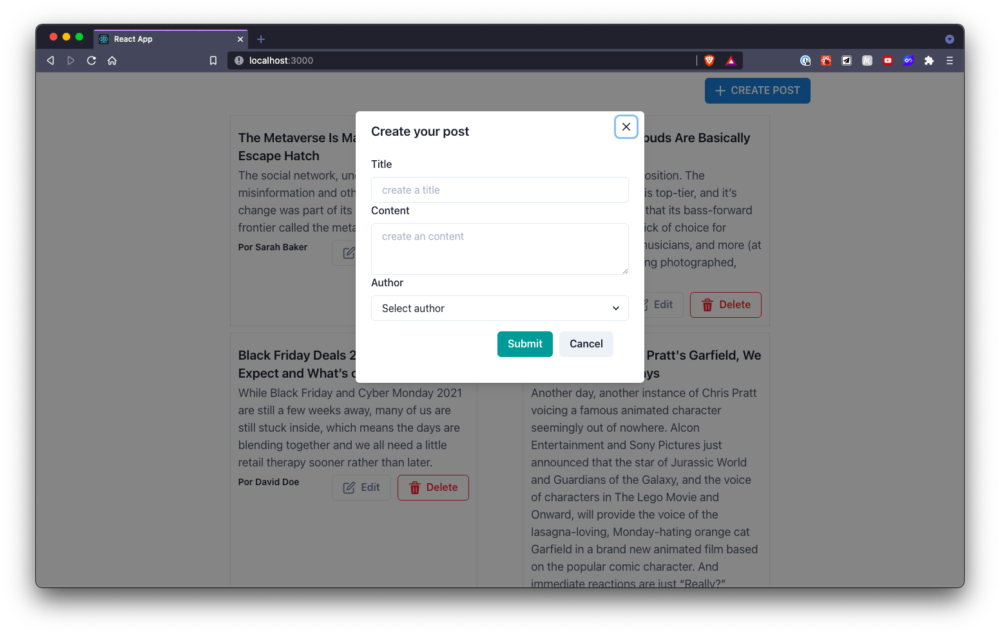

 # Challenge Plathanus
## Description

 Challenge proposed by Plathanus, the objective of demonstrating how React works. This is a simplified version of news website’ 
## Install and Run

- Clone this repository with `git clone https://github.com/FeelipePM/challenge-jungle-devs.git`
- Install dependencies using `yarn install`
- Run project in development `yarn start`
## Development
### `yarn start`

Runs the app in the development mode.\
Open [http://localhost:3000](http://localhost:3000) to view it in the browser.

## Technologies
- React
- Formik
- Styled-Components
- Axios
- Chacka-UI
- Chacka-UI Icons
## Preview
 

    
    
 

## Comments
This site will only work if the backend is running

access the application backend link.

[Access here!](https://github.com/FeelipePM/plathanus-news-backend)